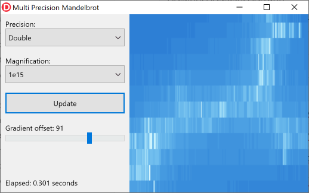
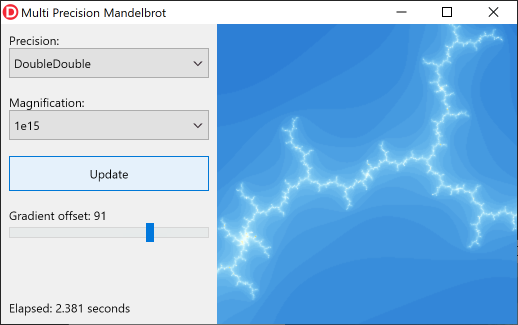

# Neslib.MultiPrecision 

## High-Precision Floating-Point Types for Delphi

Neslib.MultiPrecision adds two additional floating-point types for use with Delphi. These offer a precision that is up to 4 times larger than that of the `Double` type.

Neslib.MultiPrecision is build on top of the [QD 2.3.22](https://www.davidhbailey.com/dhbsoftware/) and works on:

* Windows (32-bit and 64-bit)
* MacOS (64-bit)
* iOS (64-bit, *no* simulator)
* Android (32-bit and 64-bit)

The algorithms used for these types were developed by David H. Bailey, Yozo Hida and Xiaoye S. Li. Take a look the the [QD.pdf](C/qd.pdf) file in the C subdirectory if you are interested in the details.

## Installation

To install:

```shell
> git clone https://github.com/neslib/Neslib.MultiPrecision
```

This library has no dependencies on other libraries. There are also no run-time dependencies. The underlying C/C++ QD library is linked into the executable using object files or static libraries.

## Two new Floating-Point Types

This library defines two additional floating-point types:

* `DoubleDouble`: this is a 128-bit type that has twice the precision of the `Double` type.
* `QuadDouble`: this is a 256-bit type that has four times the precision of the `Double` type.

Both types have the same range as the Double type (about ± 10<sup>308</sup>) but much higher precision. Compared to `Single` and `Double`:

| Type         | Exponent<br />Bits | Mantissa<br />Bits | Precision<br />(decimal digits) |
| ------------ | :----------------: | :----------------: | :-----------------------------: |
| Single       |         9          |         24         |                7                |
| Double       |         12         |         53         |               16                |
| DoubleDouble |         12         |        106         |               32                |
| QuadDouble   |         12         |        212         |               64                |

> The names `DoubleDouble` and `QuadDouble` come from the underlying QD library. I considered naming these `Float128` and `Float256` instead, but there are already official IEEE specifications for such (hardware) types. And since these are not compatible with `DoubleDouble` and `QuadDouble`, I didn't want to add confusion.

The underlying QD library does *not* use emulation for calculations. Instead, it uses the existing floating-point capabilities of the CPU to use either 2 or 4 `Double` values to increase the precision. As a result, these types are much faster than other arbitrary/high precision math libraries using the same precision. Also, as opposed to many other libraries, these types don't require dynamic memory allocations, which further helps performance and also reduces memory fragmentation.

## Usage

The `DoubleDouble` and `QuadDouble` types can be used much the same way as the `Double` type. They support the usual operators (`+`, `-`, `*`, `/`, `=`, `<>`, `<`, `<=`, `>` and `>=`) as well as most methods available for the record helpers for the `Double` type (`IsNan`, `IsInfinity`, `IsNegativeInfinity`, `IsPositiveInfinity`, `ToString`, `Parse` and `TryParse`). There are methods and operators to convert to and from `Double`, `DoubleDouble`, `QuadDouble` and `String`.

Since the Delphi language doesn't allow you to enter high-precision floating-point literals in source code, the value of a `DoubleDouble` or `QuadDouble` variable must be initialized in some other way. There are various options (assuming `DD` is of type `DoubleDouble` here):

* Use one of the `Init` overloads. For example, `DD.Init(1.23);` to initialize a `DoubleDouble` from a `Double`.
* Use an explicit cast, as in `DD := DoubleDouble(1.23);`.
* Use one of the predefined constants, as in `DD := DoubleDouble.Pi;`.
* Or perhaps the easiest way is to just assign a string value, as in `DD := '3.1415926535897932384626433832795';`.

> I didn't add *implicit* operators, such as `DD := 1.23;`, since those can lead to unintentional conversions that impact performance.

It's important that you call `MultiPrecisionInit` *before* performing any `DoubleDouble`/`QuadDouble` calculations. This prepares the FPU/CPU for high-precision math. You can use `MultiPrecisionReset` to restore the FPU/CPU to its previous state.

### Customization

The default configuration of the library is suitable for most applications. This configuration sacrifices a bit of accuracy for increased speed. If accuracy is more important than speed for your purposes, then you can compile the library with the `MP_ACCURATE` define. This will make many calculations a bit slower but more accurate.

## Mathematical Functions

The underlying QD library (and thus this library) supports a variety of common mathematical functions. In addition, the Neslib.MultiPrecision library adds numerous equivalents of functions found in the System.SysUtils and System.Math units.

| Name                                                         | Description                                       |
| ------------------------------------------------------------ | ------------------------------------------------- |
| StrToDoubleDouble, StrToQuadDouble,<br />StrToDoubleDoubleDef, StrToQuadDoubleDef,<br />TryStrToFloat | Convert from string                               |
| FloatToStr, FloatToStrF                                      | Convert to string                                 |
| Inverse                                                      | Calculate reciprocal                              |
| Rem                                                          | Calculate remainder, rounding to nearest          |
| DivRem                                                       | Calculate result of division, including remainder |
| FMod                                                         | Calculate remainder, rounded towards zero         |
| Sqrt, Sqr                                                    | Square root and Square                            |
| Trunc, Floor, Ceil, Round                                    | Various rounding methods                          |
| Abs                                                          | Absolute value                                    |
| Min, Max                                                     | Return minimum or maximum value                   |
| InRange, EnsureRange                                         | Compare against range                             |
| SameValue                                                    | Approximate equality check                        |
| Power, IntPower, NRoot, Ldexp, Exp                           | Exponential functions                             |
| Ln, LnXP1, Log2, Log10, LogN                                 | Logarithmic functions                             |
| Sin, Cos, SinCos, Tan                                        | Trigonometric functions                           |
| ArcSin, ArcCos, ArcTan, ArcTan2                              | Inverse trigonometric functions                   |
| Sinh, Cosh, SinCosh, Tanh                                    | Hyperbolic functions                              |
| ArcSinh, ArcCosh, ArcTanh                                    | Inverse hyperbolic functions                      |
| Cotan, Cot, Secant, Sec, Cosecant, Csc                       | Reciprocal trigonometric functions                |
| CotH, SecH, CscH                                             | Reciprocal hyperbolic functions                   |
| ArcCot, ArcSec, ArcCsc                                       | Reciprocal inverse trigonometric functions        |
| ArcCotH, ArcSecH, ArcCscH                                    | Reciprocal inverse hyperbolic functions           |
| RadToDeg, RadToGrad, RadToCycle                              | Convert from radians                              |
| DegToRad, DegToGrad, DegToCycle                              | Convert from degrees                              |
| GradToRad, GradToDeg, GradToCycle                            | Convert from grads                                |
| CycleToRad, CycleToDeg, CycleToGrad                          | Convert from cycles                               |

## Samples

A fun way to demonstrate high-precision math is by calculating the [Mandelbrot fractal](https://en.wikipedia.org/wiki/Mandelbrot_set). As you zoom into the fractal, you need more and more precision. The Samples subdirectory contains a FireMonkey application that generates the Mandelbrot fractal at 4 levels of precision (`Single`, `Double`, `DoubleDouble` and `QuadDouble`). 

The following image shows a tiny section of the fractal using a magnification of one quadrillion (10<sup>15</sup>, aka one billiard in Europe) and `Double` precision:



You can clearly see that the `Double` type doesn't provide enough precision at this magnification level. The `DoubleDouble` type offers more than enough precision though:



It's not until you reach a magnification level of 10<sup>31</sup>, that you need to switch to `QuadDouble`.

## More Information

There is more to Neslib.MultiPrecision than described above. For more details you can look at the well-documented `Neslib.MultiPrecision.pas` source file. Additional usage samples can be found in the UnitTests subdirectory and the Mandelbrot sample application.

If you are interested in the technical details and algorithms used for these types, you can take a look at the [QD.pdf](C/qd.pdf) file in the C subdirectory.

### Building the C/C++ Library

As said, this library is build on top of the QD library. This is a C/C++ library that is linked into your Delphi executable using object files or static libraries. If you ever need or want to build these object files and static libraries yourself, then take a look at the [readme.txt](C/readme.txt) file in the C subdirectory for instructions.

## License

Neslib.MultiPrecision is licensed under the Simplified BSD License. See License.txt for details.

The underlying QD library is licensed under the BSD-LBNL License. See the document [BSD-LBNL-License.doc](C/BSD-LBNL-License.doc) in the C subdirectory for details. 